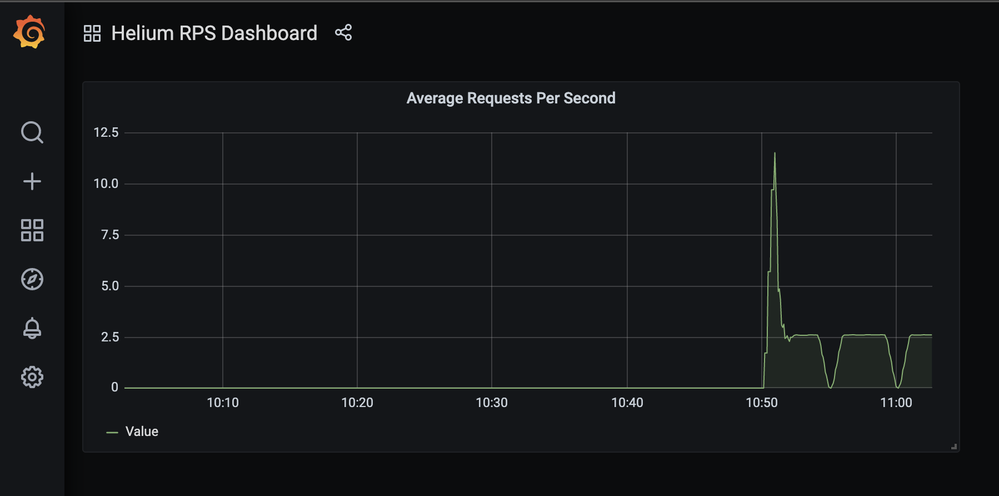
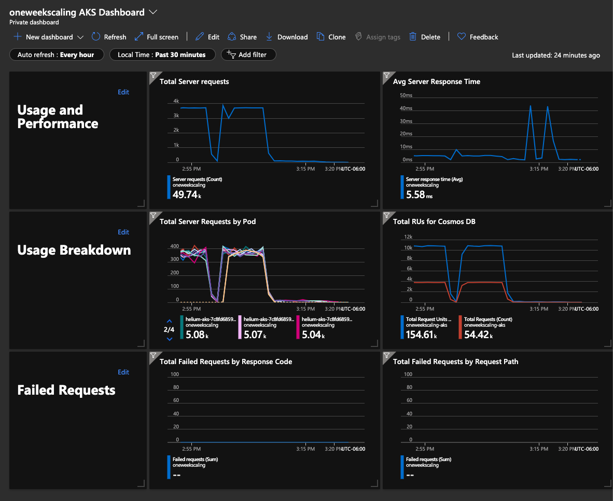

# Autoscaling the application

## Goals

- ~~Expand current cluster by adding new nodes~~ (Scrapped since this is a Platform feature, not related to Istio)
- Use a horizontal pod autoscaler (HPA) resource to scale pods in same cluster
- *Bonus: Look into scaling Cosmos DB when the load is high as well*

### HPA with Prometheus Adapter

The default Istio installation includes the Prometheus metrics server, where various network metrics are stored. By porting these Prometheus metrics as a custom Kubernetes metric `custom.metrics.k8s.io/v1beta1` using a [Prometheus Adapter](https://github.com/DirectXMan12/k8s-prometheus-adapter), we can leverage the native Kubernetes Horizontal Pod Autoscaler (HPA) object to scale the pods.

For this hack session, we used the following Prometheus query to calculate the incoming requests per second for the Helium application.

```promql

avg(rate(istio_requests_total{pod_name=~"helium.*"}[1m]))

```

#### Prometheus Adapter Setup

> NOTE: All the YAML template files used in this setup are available in the manifests directory. Move and/or modify them as needed to fit your need.

Install the Prometheus Adapter and create the HPA object. Refer to the [Kubernetes Documentation](https://kubernetes.io/docs/tasks/run-application/horizontal-pod-autoscale/#support-for-configurable-scaling-behavior) for more information on adjusting the HPA scaling parameters.

```bash

# Add the custom helm repo and install the adapter using the config file
helm repo add prometheus-community https://prometheus-community.github.io/helm-charts
helm install prometheus-adapter prometheus-community/prometheus-adapter -f prom-adapter-config.yaml

# Create the HPA object
kubectl apply -f hpa.yaml

```

#### Stress test the application

Run the [smoke tests](../aks/README.md#smoke-tests) suite to stress test your application and drive the Request Units (RUs) on the Cosmos DB.

#### Visualize Scaling with Grafana

Use the Grafana monitoring tool included with the default Istio installation to observe the application pod scaling behavior in action.

```bash

# Access Grafana (live tail metrics dashboard)
istioctl dashboard grafana

# Create a custom dashboard by importing the grafana-dashboard.json file into Grafana
grafana-dashboard.json

# Save the dashboard so you can access it on future sessions in Grafana

```

You will end up with a dashboard that looks like this.



#### Visualize Scaling with Azure Dashboards

Replace the values in the `azure-dashboard.json` file surrounded by `%%` with the proper environment variables.

```bash

sed -i "s/%%SUBSCRIPTION_GUID%%/$(eval $He_Sub)/g" azure-dashboard.json && \
sed -i "s/%%AKS_RESOURCE_GROUP%%/${He_App_RG}/g" azure-dashboard.json && \
sed -i "s/%%COSMOS_RESOURCE_GROUP%%/${Imdb_RG}/g" azure-dashboard.json && \
sed -i "s/%%HE_NAME%%/${He_Name}/g" azure-dashboard.json

```

You should see a dashboard similar to below.



#### Autoscale Cosmos

Refer to this [documentation page](https://docs.microsoft.com/en-us/azure/cosmos-db/how-to-provision-autoscale-throughput?tabs=api-async) enable autoscaling throughput for the Cosmos DB instances.
