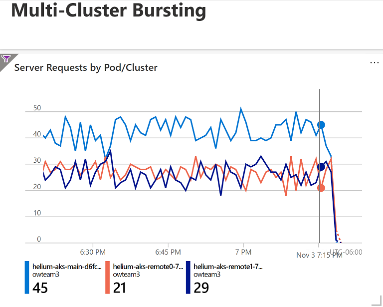
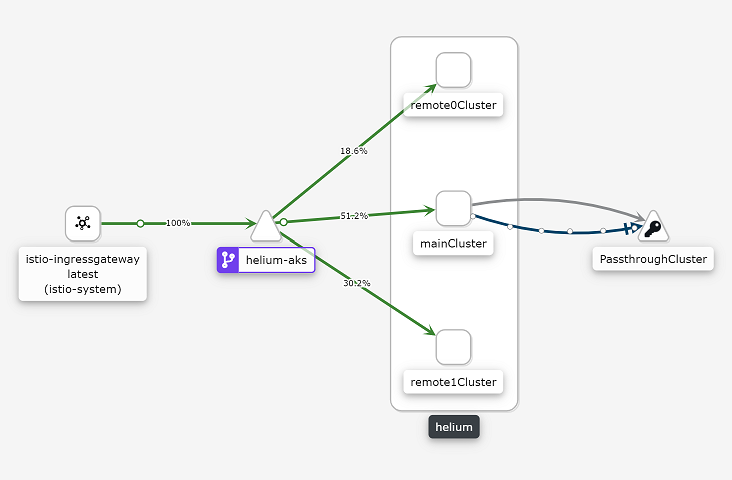

# Multi-cluster Service Mesh

## Goals

- Burst/Route Helium traffic to different clusters​
- Setup Dashboard showing traffic flow between cluster​

### Overview

Our setup is one service mesh with 3 AKS clusters. There is one main cluster with the Istio control plane and two remote clusters. The `aks` directory was copied into this `multicluster` directory so we could update different parts of the configs safely for our use case. We deployed the helium-csharp app to the main cluster and the helium-typescript app to the two remote clusters.

### Lessons Learned

- Setting up Istio to span multiple clusters
- Routing traffic between clusters by using virtual services and destination rules
- Visualizing traffic in the mesh with Kiali
- Visualizing traffic with App Insights and dashboards
- Helpful to use the Kubernetes cluster name when setting up the Istio configs for each cluster. For example, if the AKS cluster is named `aks-remote1-centralus`, then in the Istio config, use the same name, instead of something like `remote1`.

